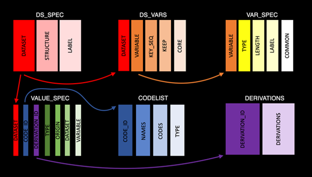
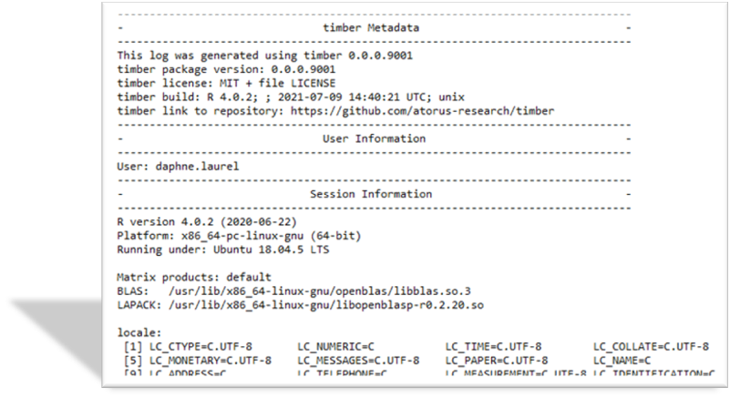
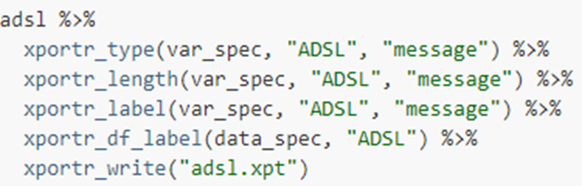
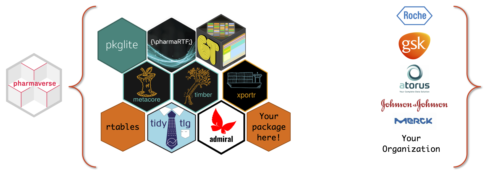

class: middle, center

# Outline

<br/>

1. Defining the Clinical Reporting Pipeline

2. Open Source in a Regulated Environment

3. A collaboration begins between Atorus and GSK

4. Overview of the 3 Packages – {metacore}, {timber}, {xportr}

5. Welcome to the {pharmaverse}!

---

# The Clinical Reporting Pipeline

.two-column[

.left-col[
.center[
### Here we focus on during/after the clinical trials

]


]

.right-col[
```{r, echo = FALSE, results = 'asis'}
nomnoml::nomnoml(
  "
  [Collected|
  CRFs
  Lab Assays
  PK
  Medical Coding
]

[Tabulation|
  SDTM
  Traceability
  No derivations
  Comprehensive
]

[Analysis Ready|
ADaM
\"One Proc Away\"
Derived data
Traceability
] 

[Results|
Data Displays
Case Study Report
Submission Package
Quality Control
]

[Delivery to Agency|
eCTD Portal
]

[Collected] -> [Tabulation]
[Tabulation] -> [Analysis Ready]
[Results] -> [Delivery to Agency]
"
)
```
]

]


---

# Challenges of using an Open-Source Language in a Regulated Environment

.two-column[

  .left-col[

  **An Incomplete List of Challenges** 

  - SAS® processes have years of use within regulatory agencies and tend to take precedence.   

  - Company Firewalls and VPNs.  

  - Sharing of code and data. 

  - Does a R package bend to SAS® processes or does the package recreate/redefine the process?

  - Who maintains the open-source product?

  ]

  .right-col[

  **An Incomplete List of Solutions**

  - Github, Gitlab and etc. help us to share, fix and build up code in an interactive and version-controlled process.

  - R Consortium is working with the FDA to investigate delivering a submission in R.

  - R packages already out there that mimic some of SAS® processes – {haven}, {SASxport}

  - Pharma companies will have a vested interest in maintaining these packages.

  ]

]


---

# Why xportr is not on CRAN(yet)

---

# {metacore}

.two-column[

.left-col[

]

.right-col[
**Challenges for R in CRP**

- No available R packages that can ingest and parse metadata for clinical trial datasets or help build a define.xml.

**Solutions**

- Built functions for parsing xml data and other data types specific to clinical trial datasets.

- Functions and objects can be leveraged to help for dataset and variable creation as well as user for creating and codelist and derivations.

**Future development path**

- Working with different company's metadata files as well as in-development packages, e.g., admiral, to leverage metadata upstream or downstream.
]

]


---

# {timber}

.two-column[

.left-col[

]

.right-col[
**Challenges for R in CRP**

- There is no SAS-like log file for R-based programs that show traceability and help to create audit-ready code.

**Solutions**

- Created a utilities and wrapper functions to capture user info, session information and warnings and errors in an easy-to-read format.

- Allows for recreation of script, not just the output.

**Future development path**

- Interactive display screen to batch submit multiple programs.

- What else should go in a log?  Companies might have different needs.
]
]


---

# {xportr}

.two-column[

.left-col[

]

.right-col[
**Challenges for R in CRP**

- Writing a compliant xpt file using haven or other xpt-supported packages is challenging for types, lengths and labels

**Solutions**

- Adding well defined metadata

- Helps to write compliant xpt files

- Logs and messages for information about metadata

- Checks on the data before final output

**Future development path**

- How to ingest metadata specifications from different companies and different file formats
]
]


---

# End to End Example

<iframe src='www/example.html' style="width:100%;height:85%;"/>

---

# Welcome to the `{pharmaverse}`!



